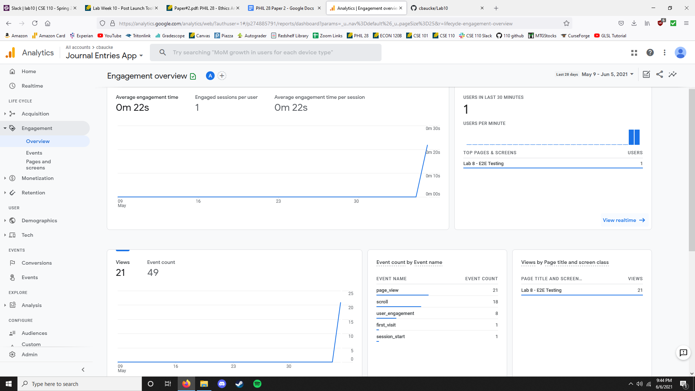

# Lab 10
Link to canny.io: [https://cse110-lab10-cbaucke.canny.io/](https://cse110-lab10-cbaucke.canny.io/)

Second split: The difference should be that the "on" treatment turns the background colors to dark greys, and the "off" treatment keeps the colors as they were.

Link to index.html: [https://cbaucke.github.io/Lab10/index.html](https://cbaucke.github.io/Lab10/index.html)

Link to secondSplit.html: [https://cbaucke.github.io/Lab10/secondSplit.html](https://cbaucke.github.io/Lab10/secondSplit.html)

Google Analytics Screenshot:

